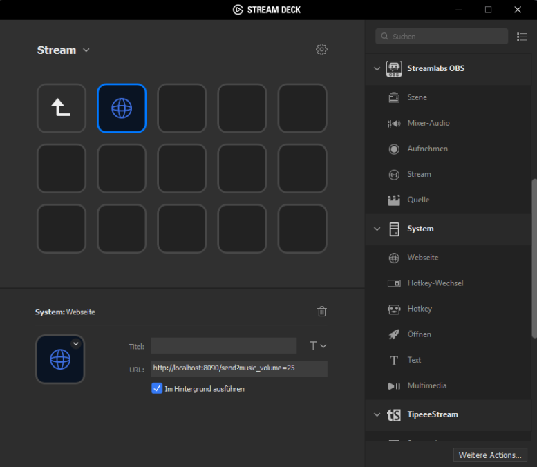

You can remote control TTVStreamerTool very easily via a Streamdeck. To do so use "Website" hotkeys and use the overlay command URLs to control anything you would via hotkeys in the overlay view.
Simply put you command in the URL behind `http://localhost:8090/send?`. Make sure to tick the box to open the website in the background to not disturb you game.

